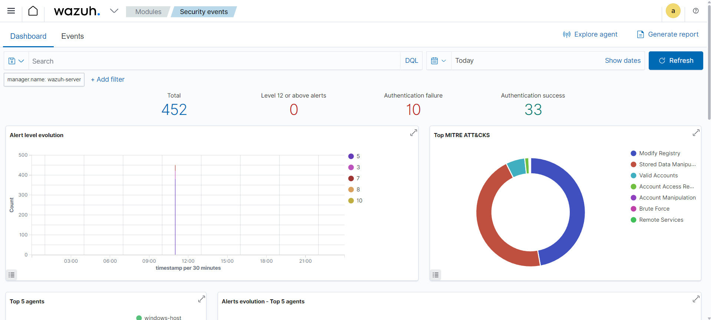
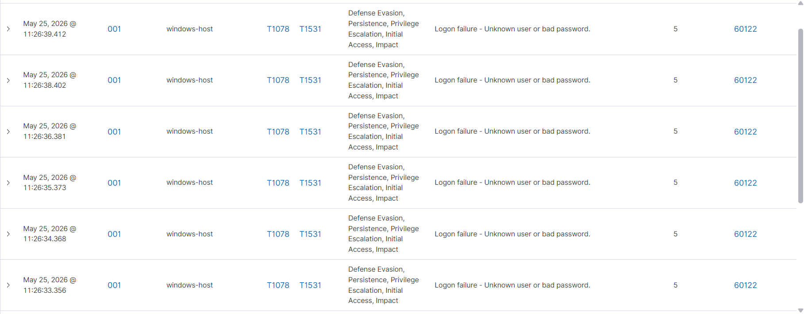
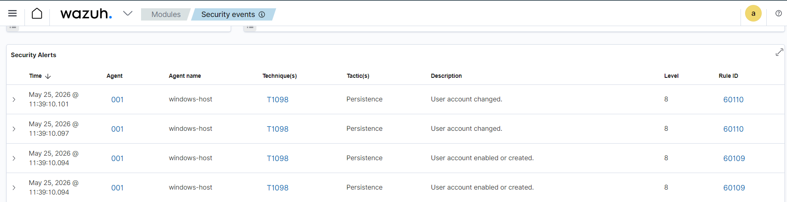
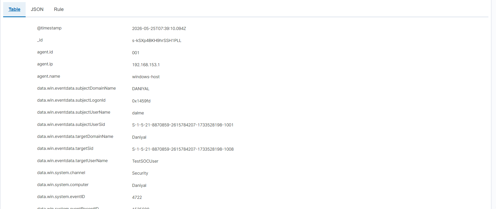
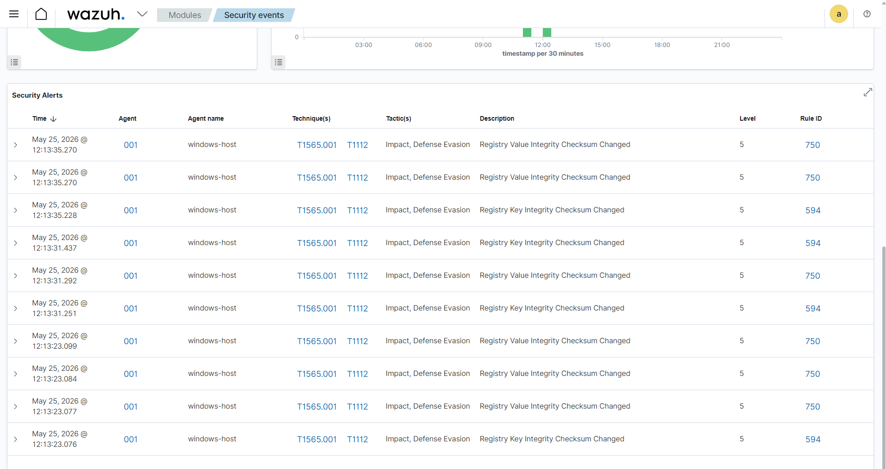
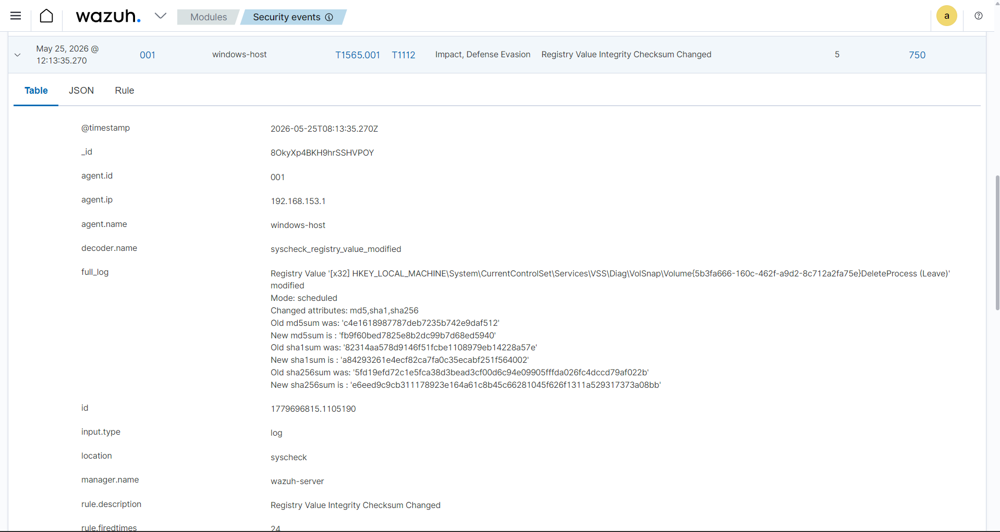

# Wazuh SOC Detection Lab

A home SOC lab built on VMware Workstation Pro running Ubuntu 24.04, 
using Wazuh SIEM 4.7 to detect real security threats on a monitored 
Windows 11 endpoint.

## Lab architecture

- **Wazuh manager** — Ubuntu VM (VMware Workstation Pro, 6GB RAM)
- **Monitored endpoint** — Windows 11 host with Wazuh agent installed
- **Dashboard** — Wazuh web UI at https://192.168.153.131

## Detection scenarios

### Scenario 1 — Brute force login detection

Simulated 10 failed login attempts using a PowerShell script. 
Wazuh detected all 10 authentication failures mapped to MITRE ATT&CK T1110.

**Rule fired:** 60122  
**Event ID:** 4625 (Windows failed logon)  
**MITRE:** T1110 — Brute Force  

---

### Scenario 2 — Unauthorized user account creation

Created a test local user account via PowerShell. Wazuh detected 
the account creation in real time and mapped it to MITRE ATT&CK T1098 
— a common attacker persistence technique.

**Rule fired:** 60109  
**Event ID:** 4720 (User account created)  
**MITRE:** T1098 — Account Manipulation  

---

### Scenario 3 — Registry integrity monitoring (FIM)

Configured Wazuh FIM on the Windows endpoint. Wazuh detected 
registry key and value modifications, automatically mapping findings 
to GDPR, HIPAA, and PCI-DSS compliance frameworks.

**Rule fired:** 750, 594  
**MITRE:** T1565.001 — Stored Data Manipulation, T1112 — Modify Registry  
**Compliance:** GDPR II_5.1.f · HIPAA 164.312.c.1 · PCI-DSS 11.5  

---

## Key takeaways

- Deployed full Wazuh stack from scratch on Ubuntu — manager, 
  indexer, and dashboard
- Connected a Windows 11 agent and generated real security alerts
- Detected 3 attack scenarios mapped to MITRE ATT&CK techniques
- A single registry change automatically triggered compliance findings 
  across GDPR, HIPAA, and PCI-DSS simultaneously
- Documented all findings following SOC Tier 1 investigation workflow

## Tech used

Wazuh 4.7 · Ubuntu 24.04 · VMware Workstation Pro · Windows 11 · 
MITRE ATT&CK · PowerShell